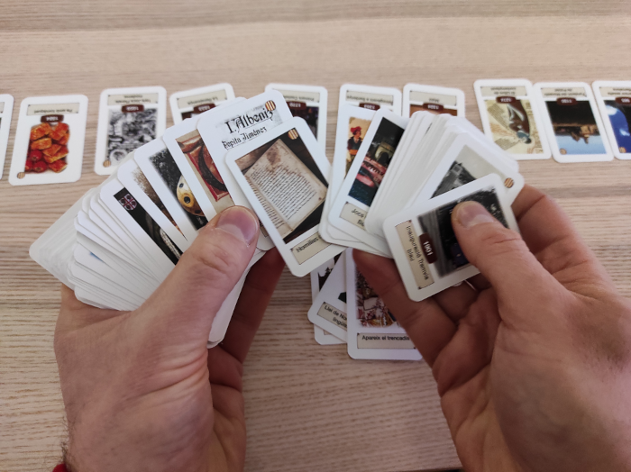
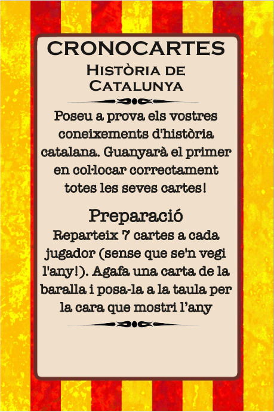
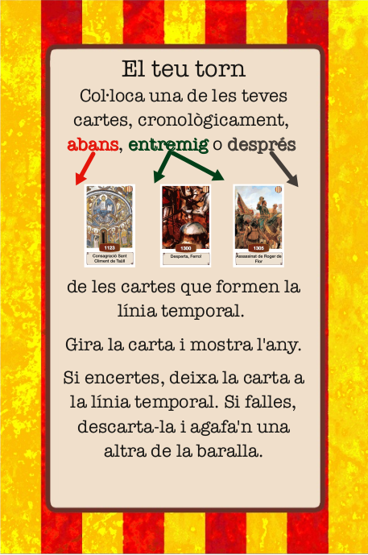

# Cronocartes Història de Catalunya

Descobreix la història de Catalunya a través del joc de cartes, **Cronocartes**,
on historiadors rivals competiran per demostrar el seu coneixement de la història
de Catalunya.

**Cronocartes** és un joc de cartes ràpid i familiar: només necessiteu 30 segons
per aprendre a jugar i les partides no acostumen a durar més de 20 minuts.
Molts adults tenen por de jugar per vergonya a una suposada ignorància en temes
històrics, però ja veureu com no n'hi ha per a tant! Us divertireu!

## Com es juga

Trobareu les instruccions en una de les cartes de la mateixa baralla:

| |  |
|:----:|:-----:|

### Preparació

Seguiu aquests passos per preparar la partida:

1. Mescleu bé les cartes i repartiu-ne 7 a cada historiador cara avall (per la
cara que no mostra l'any).
2. Un cop repartides les cartes, preneu la carta superior de la pila de cartes
restant i poseu-la cara amunt de tal manera que l'any ha de quedar a la vista.
Aquesta serà la carta inicial de la línia temporal.

Ja esteu a punt per començar!

### El teu torn

En el teu torn hauràs d'agafar una de les teves cartes que estan cara avall i
col·locar-la a la línia temporal, on creguis que respecta l'ordre cronològic.
Després d'haver-te decidit, gira la carta. En aquest moment poden passar dues coses:

- La carta respecta l'ordre cronològic (ben fet!👏), deixa la carta a la línia temporal.
- La carta no respecta l'ordre cronològic (t'has equivocat!😥), descarta la carta i pre-ne una altra de la pila de cartes.

Un cop hagis resolt un d'aquests casos, passa el torn al/la següent historiador/a.

### Final del joc

En el moment en què un/a historiador/a col·loca correctament la seva última carta,
es dispara el final del joc i s'acaba la ronda (per tal que tots els/les historiadors/es
hagin jugat el mateix nombre de torns).

Al final de l'última ronda, el jugador que s'hagi quedat sense cartes guanya la partida!

En cas que a l'última ronda hagi hagut un **empat** i més d'un/a historiador/a hagi
acabat les seves cartes, la victòria es decidirà per mort sobtada: s'aniran jugant cartes
i els/les finalistes quedaran eliminats en cas de col·locar incorrectament una carta.

### Variant avançada

Si voleu fer el joc una mica més difícil, en comptes de descartar la carta en cas
d'equivocació, col·loqueu-la correctament a la línia temporal.

### Estratègia

**Un consell**: tot i que esteu temptats a col·locar primer les cartes que sabeu,
heu de fer precisament el contrari! Jugueu primer les que són més dubtoses. Si
no ho feu així, a mesura que la línia temporal es vagi poblant de cartes, us
serà més difícil afinar l'any i la probabilitat d'equivocar-se serà més alta.
