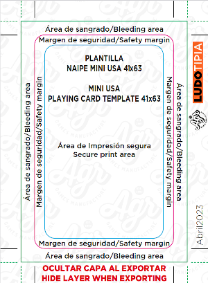
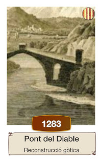
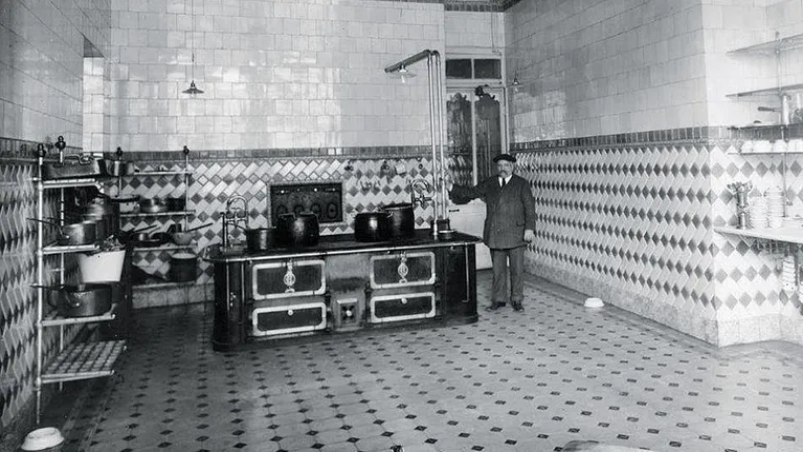
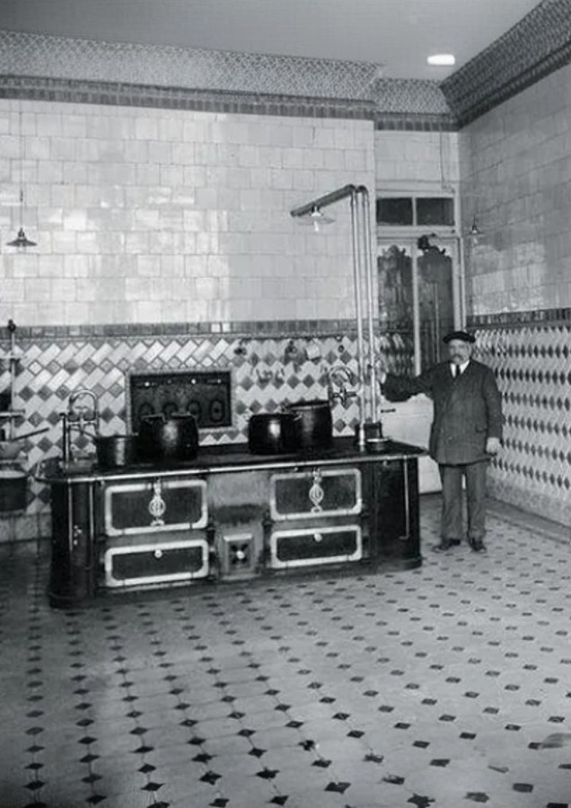

# Com fer el teu Cronocartes

El joc [Cronocartes Història de Catalunya](https://boardgamegeek.com/boardgame/326235/cronocartes-historia-de-catalunya)
és un joc de cartes ràpid i familiar en què els jugadors competeixen ordenant
una línia cronològica. Està basat en els populars jocs de cartes
[Timeline](https://boardgamegeek.com/boardgame/128664/timeline) o [Cardline](https://boardgamegeek.com/boardgame/130882/cardline-animals).

El joc és fàcilment portable a altres temes que
requereixin una cronologia (moments èpics de la saga [Star Wars](https://boardgamegeek.com/boardgame/183797/timeline-star-wars),
història del barri de Sants de Barcelona...). De fet, diverses persones
interessades en el format m'han preguntat per consells de com fer una versió
del Cronocartes, així que us deixo aquest post amb alguns apunts i consells sobre el disseny
per si us poden ser útils.

<!-- more -->

## Comença la casa pel terrat

No sóc dissenyador gràfic, i una de les pors més grans que tenia era fer un
disseny que després hagués d'anar modificant en funció del servei d'impremta.
Així que, un cop decidit a fer la versió catalana del Cronocartes, vaig buscar
un servei d'impremta que tingués aquestes característiques:

- Poder tenir un pressupost immediat via web, sense haver d'enviar formularis web,
i fer-me una idea ràpida de quan pujaria el cost més important de la producció.
- Que oferissin la mateixa mida de cartes que el Timeline per tal de poder-les combinar (Mini USA 41 x 63 mm)
- Disponibilitat de descàrrega de la plantilla per fer les cartes.
- Format de la plantilla suportat per algun programari lliure
(mireu la secció [Eines](#eines) avall).

La que vaig acabar escollint era [Ludotipia](https://www.tipia.es/ludotipia)[^1],
i amb aquesta decisió va quedar fixat:

- El número total de cartes: **108** (l'aplicatiu web dóna diverses opcions, i aquesta
era la més propera a jocs similars)
- La [plantilla](https://www.tipia.es/_files/ugd/f4b6f7_9299a0b3540f404bba309bff86549202.pdf)
per maquetar les cartes, amb tots els marges necessaris. Teniu una imatge de la plantilla
abaix tot i que us recomano que treballeu amb el PDF original per que no tingueu
sorpreses amb les mides quan genereu els fitxers finals.

[^1]: No tinc cap vincle contractual amb ells ni cobro cap mena de comissió
o ingrés de publicitat per part seva.

## Eines

Els programes de disseny gràfic com Adobe Photoshop i similars acostumen a
estar fora del pressupost dels dissenyadors aficionats, pel que la opció de
programari lliure és la opció més econòmica. De fet, són eines que cobreixen
amb escreix les tasques que s'han de realitzar. Us passo a continuació
una relació de les eines que he utilitzat i l'ús que li he donat:

- [Scribus](https://www.scribus.net/) és una aplicatiu d'escriptori per autoedició que he
utilitzat per maquetar les cartes. Una de les característiques fonamentals d'aquesta
aplicació és que permet fer el que es coneix com a "mail-merge": generar totes
les cartes d'una manera automàtica, ràpida i senzilla a través d'una sola plantilla i un fitxer de text
en format Comma Separated Value (CSV) que conté totes les dades de cadascuna de les cartes.
- [LibreOffice Calc](https://www.libreoffice.org/discover/calc/) per editar fulles
de càlcul i guardar-les en format CSV. La idea és generar un fitxer en que cada
fila contingui títol, any i imatge per cada carta. Amb aquest fitxer i la plantilla
de maquetació es poden generar totes les cartes de la baralla (i no haver d'anar
muntant les cartes una a una). Al ser fitxers de text, la veritat és que hi
han moltes alternatives per editar CSV: si ets programador, pots utilitzar
[VS Code](https://code.visualstudio.com/) amb l'extensió [Edit CSV](https://edit-csv.net).
- [Gimp](https://www.gimp.org/), programari lliure d'edició gràfica, indispensable
per manipular les imatges (sobretot escalat, rotacions, *crop*, manipulació de colors i filtrat
d'imatges, ...)

El sistema operatiu que utilitzo és Ubuntu/Linux, però tot aquest programari
té versions per altres sistemes operatius.

## Events

Juntament amb la creació de les [Imatges](#imatges), el llistat d'events és el
més complicat. Encara que no ho sembli, buscar 100 events històrics que estiguin
documentats i més o menys distribuïts en els 2000 anys d'història pot ser complicat.
En el cas del Cronocartes Història de Catalunya vaig tenir en compte els
següents punts:

- Volia afegir un punt de complexitat així que la majoria de cartes estan
concentrades a finals del segle XIX i principis del XX.
- Trobar events del primer mil·leni pot ser un repte per que no hi han gaires
referències escrites (a excepció d'events clau com guerres, tractats o revoltes).
- Hi ha vegades én que és impossible saber l'any exacte d'un event. En aquests casos
podeu posar una *c.* (del llatí *circa*, aproximadament) abans de l'any. Una altra
alternativa més fàcil d'interpretar pot ser *~*.
- Si us costa trobar la data d'algun event, opteu per posar la primera referència
escrita sobre l'event (el cas paradigmàtic del Cronocartes Història de Catalunya
és el *Mató*, sabeu de quin any es té la primera referència? 😜)
- L'espai pel text de l'event és reduït (més del que sembla). Haureu de ser
creatius per reduir el nombre de caràcters! No dubteu a utilitzar ordinals
en comptes de paraules (per exemple *1r* en comptes de *Primer*). Algunes
vegades he hagut de recórrer a un subtítol (amb un tipus de lletra més petit) en cas que calgués donar una mica
més de context, com es mostra en l'exemple que segueix:

## Imatges

Per les imatges de la versió d'Història de Catalunya vaig recórrer a imatges
d'internet i alguna composició pròpia. Compteu moltes hores de manipulació
d'imatges amb GIMP per acabar d'ajustar-les al format de les cartes. Cal dir
que també és una de les parts més creatives del procés, i les possibilitats i
eines que dona un programa com GIMP són innumerables.

Arribats a aquest punt, haureu de vigilar amb els **drets d'autor**, especialment si voleu
distribuir comercialment el producte. Assegureu-vos que les imatges es poden utilitzar
per finalitats comercials. Si teniu dubtes, considereu altres alternatives.
En el meu cas, per altres versions estic utilitzant
eines d'intel·ligència artificial que a més agilitzen substancialment el procès de
creació d'imatges a partir d'un prompt o una altra imatge (o combinació d'imatges).
Les eines que he utilitzat són:

- [Krea.ai](https://www.krea.ai/), eina bastant potent que permet generar imatges a partir
d'una frase o bé a partir d'altres imatges.
- [Uncrop](https://clipdrop.co/uncrop), eina que permet estendre una imatge (*uncrop*) i arribar a una
certa resolució o mida. Molt més útil del que pot semblar a simple vista,
sobretot per fotografies antigues amb mida reduïda. A baix incloc un exemple on
la imatge original (esquerra) s'ha modificat per estendre-la per la part superior
i generar un sostre (imatge de la dreta).

| Imatge original | Imatge *uncropped* |
|:-----:|:------|
| ||

Ambdues eines són gratuïtes, però tenen funcionalitat limitada.
En el meu cas, els límits d'ús són més que suficients, però m'he plantejat
més d'un cop concentrar la feina de modificació d'imatges en un mes i subscriure'm
a aquests serveis un parell de mesos per tenir accés a més prestacions
que poden ser útils (processat més ràpid i cap limitació en el nombre d'imatges generades,
eliminació del fons, ...).

## Automatitzant el procés

Fer un joc de taula és un procés iteratiu, pel que cal tenir un mètode que permeti:

- Regenerar totes les cartes d'una manera ràpida i àgil per tal de poder provar
fàcilment vàries opcions de disseny i maquetació.
- Tenir un control de les diferents versions que es van fent del mateix. D'aquesta
manera tot el procés de creació serà reproduible i traçable.

Automatitzar tot el procés garanteix la consistencia en el disseny de tot el joc
i evita els "casos especials" que acaben sent un malson quan es va modificant
el disseny. Sempre que podeu, intenteu pensar com automatitzar el disseny
des del principi de la creació del joc.

Per aquest motiu l'elecció de les eines és critica. Una de les prestacions més
important d'Scribus és el fet de poder fer *mail-merge*:
creació de totes les cartes a partir d'una sola plantilla i un CSV amb les dades
de totes les cartes. Aquest procés es pot realitzar amb el plug-in
[Scribus Generator](https://berteh.github.io/ScribusGenerator/).

Si teniu interès en aquest procés, feu-m'ho saber a través d'algun dels canals
llistat a la secció [About me](../about.md#em-podeu-trobar-per-aqui), hi dedicaré
un post exclusivament a descriure la metodologia que he utilitzat (tot i que
aviso que calen certs coneixements de programació informàtica).
