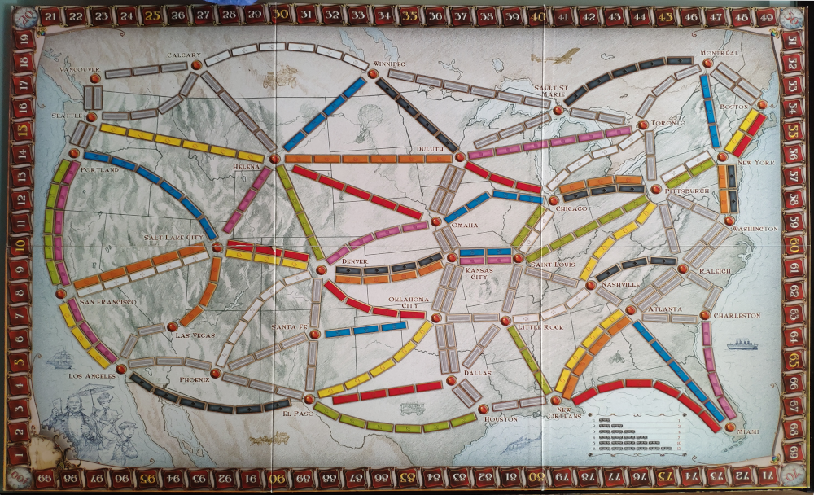
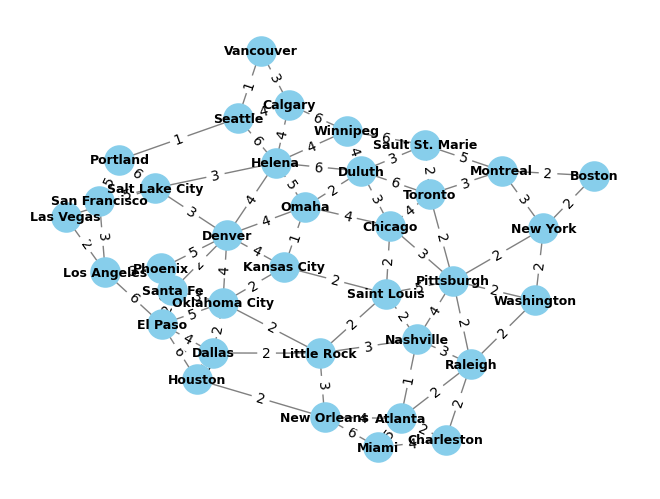
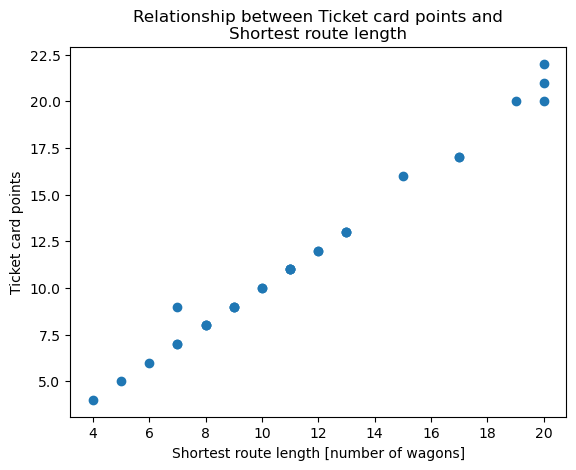

# Graph theory to model Ticket to ride

This post contains a basic analysis of the mathematical model behind the board game [Ticket to Ride](https://boardgamegeek.com/boardgame/9209/ticket-ride) by leveraging graph theory.

As you know, "Ticket to Ride" is a game where players aim at completing train routes in the most efficient way possible. The first version of the game is set in the United States of America in the late 19th century during the railroad expansion.



Modeling the game is understood as assessing the distribution of:

- Number of tracks and associated colors
- Track lenghts (i.e. number of wagons required to complete the track)
- Shortest route between two stations¡

<!-- more -->

## Analysis

To do this analysis, we have used following key libraries:

- [Pandas](https://pandas.pydata.org/) for data loading and processing
- [NetworkX](https://networkx.org/) for graph processing and above all, to **find the shortest path between two stations** (nodes).

First we will need to install some required libraries as well as import necessary modules

```python
!pip install matplotlib networkx pandas
```

```python
import matplotlib.pyplot as plt
import networkx as nx
import pandas as pd
```

The following cells contain some constants used in the notebook as well as the links to the CSVs that contain the Tracks and routes

```python
TRACK_LENGTH_COLUMN = 'length'
FROM_COLUMN = 'from'
TO_COLUMN = 'to'

TRACKS_CSV_FILE_URL = 'https://raw.githubusercontent.com/mgfernan/mgfernan.github.io/master/docs/assets/Ticket_to_ride%20-%20Tracks.csv'
TICKETS_CSV_FILE_URL = 'https://raw.githubusercontent.com/mgfernan/mgfernan.github.io/master/docs/assets/Ticket_to_ride%20-%20Tickets.csv'
```

First let's load the Track CSV, this will be used to visualize the track network as a mathetmatical graph (of nodes/stations and edges/tracks). The CSV contains the two stations for each track as well as their associated color and lenghts (number of wagons required to complete the track)

```python
df = pd.read_csv(TRACKS_CSV_FILE_URL)
df[TRACK_LENGTH_COLUMN] = pd.to_numeric(df[TRACK_LENGTH_COLUMN])
df.head()
```

|   | from         | to        | color | length |
|---|--------------|-----------|-------|--------|
| 0 | Washington   | New York  | black | 2      |
| 1 | Pittsburgh   | Chicago   | black | 3      |
| 2 | Raleigh      | Nashville | black | 3      |
| 3 | Duluth       | Winnipeg  | black | 4      |
| 4 | Kansas City  | Denver    | black | 4      |

With this `DataFrame` we can know useful information such as:

- Number of total tracks
- Number of wagons required for each color
- Track distribution for each color

In addition, we can use the `DataFrame` to create the **graph** using the `networkx` library and make a visual representation of the track network

```python
# Create a directed graph with weighted edges
graph = nx.from_pandas_edgelist(df, FROM_COLUMN, TO_COLUMN, edge_attr=TRACK_LENGTH_COLUMN, create_using=nx.Graph())

# Plot the graph
pos = nx.spring_layout(graph, weight=TRACK_LENGTH_COLUMN, seed=4)
nx.draw(graph, pos, with_labels=True, node_size=400, node_color='skyblue', font_size=9, font_color='black', font_weight='bold', edge_color='grey', linewidths=2)

# Add edge labels showing weights
edge_labels = nx.get_edge_attributes(graph, TRACK_LENGTH_COLUMN)
nx.draw_networkx_edge_labels(graph, pos, edge_labels=edge_labels)

# Display the plot
plt.show()
```



The advantage of modeling the track network as a graph is that we can use already existing libraries to compute the shortest path between two stations (both the passing stations as well as the total length), as in the following example

```python
FROM = 'El Paso'
DESTINATION = 'Raleigh'

shortest_path = nx.shortest_path(graph, source=FROM, target=DESTINATION, weight=TRACK_LENGTH_COLUMN)
print(f'The shortest path goes through these stations: {" - ".join(shortest_path)}' )

shortest_path_length = nx.shortest_path_length(graph, source=FROM, target=DESTINATION, weight=TRACK_LENGTH_COLUMN)
print(f'The length for the shortes path is: {shortest_path_length}')

```

    The shortest path goes through these stations: El Paso - Dallas - Little Rock - Nashville - Raleigh
    The length for the shortes path is: 12

These methods (specially `nx.shortest_path_length`) are very relevant to reverse engineer the ticket cards (that give points if a player completes a route). Basically we need to know how the points awarded per card is related to the shortest path.

To do so, we will load the Ticket CSV into a `DataFrame` and compute the shortest path for each card:

```python
# Load the Ticket CSV
df_tickets = pd.read_csv(TICKETS_CSV_FILE_URL)

# Create a new column in the dataframe with the shortest path length for each route (i.e. ticket card)
df_tickets[TRACK_LENGTH_COLUMN] = df_tickets.apply(lambda r: nx.shortest_path_length(graph, source=r[FROM_COLUMN], target=r[TO_COLUMN], weight=TRACK_LENGTH_COLUMN), axis=1)

df_tickets.head()
```

|   | from          | to           | points | length |
|---|---------------|--------------|--------|--------|
| 0 | Los Angeles   | New York      | 21     | 20     |
| 1 | Winnipeg      | Little Rock   | 11     | 11     |
| 2 | Vancouver     | Santa Fe      | 13     | 13     |
| 3 | Montreal      | Atlanta       | 9      | 9      |
| 4 | Toronto       | Miami         | 10     | 10     |

At this point we can realise that the points awarded per route are in fact equivalent (at least on the most cases) with the lenghts (i.e. total number of wagons required to complete the route), which makes sense.

```python
plt.plot(df_tickets[TRACK_LENGTH_COLUMN], df_tickets['points'], 'o')
plt.xlabel('Shortest route length [number of wagons]')
plt.ylabel('Ticket card points')
plt.title('Relationship between Ticket card points and\nShortest route length')
plt.show()
```



## Key takeaways

From the analysis, the following takeaways are relevant in case you need to
make your own *customization* of Ticket to ride:

- There are 36 stations
- There are a total of 100 tracks (double tracks are considered independent tracks)
- Each color (except grey) needs a total of 27 wagons to complete their tracks
- Each color (except grey) has a total number of 7 tracks, and their distribution
is: 6-5-4-4-3-3-2, except for green and white, for which their distribution is:
6-5-5-4-3-2-2.
- To the largest possible extent, the colors are homogeneously distributed on
the territory (which makes sense in order to balance the game).
- There are 30 ticket cards
- The points for each ticket card represent the shortest path length (i.e. minimum number
of wagons required to complete the card), with some small exceptions.

You can reproduce the results of this post using the Jupyter Notebook accessible
in [this link](../assets/Ticket_to_ride_graph_analysis.ipynb). You can also use
tools such as [nbviewer](https://nbviewer.org/) or Google Colab to run the code.
