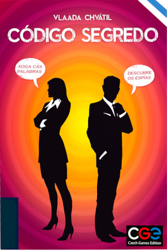
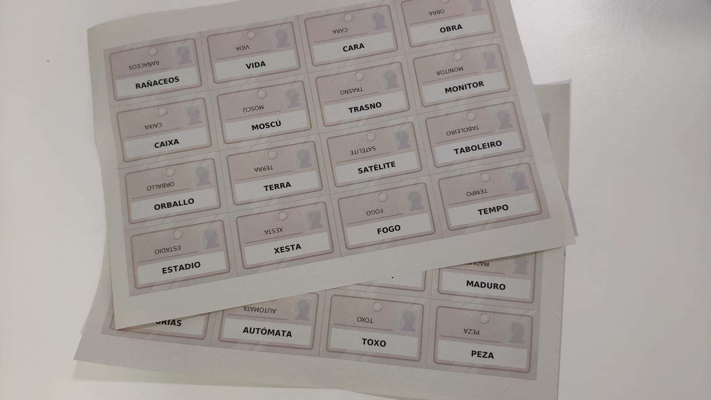

Seguro que moitos de vós coñecedes o xogo de mesa “[Código Secreto](https://boardgamegeek.com/boardgame/178900/codenames)”, no que dous equipos de espías tratan de localizar os seus axentes de campo usando palabras. Como é unha carreira para ver que equipo completa antes esta tarefa, é crucial usar pistas que agrupen ou asocien múltiples palabras clave que identifican os nosos axentes de campo.

<!-- more -->

Saberedes seguramente que existen variantes de este xogo en diversos idiomas, a castelán por suposto, pero tamén hai a versión comercial en catalán. Como non vin a versión en galego me aventurei a facela, e neste periplo aprendín un par de ideas que quizais podan ser útiles a quen queira crear expansións a outros idiomas como o éuscaro, suahili ou casaco.  Por que non nos enganemos, traducir o “Código Segredo” non é simplemente traducir literalmente as palabras: hai que trasladar tamén o contexto das palabras. Cando te poñas a traballar, ten en conta estas ideas:

- **Polisemia e homografía**. En “Código Segredo” é crucial que haxan palabras con múltiples significados para que os xogadores podan buscar asociacións de termos. O problema é que en linguas que derivan da mesma raíz (por exemplo o latín), os varios significados que pode agrupar una palabra nun idioma pódense reducir noutro. Por exemplo, “taula” en catalán significa mesa e táboa (en galego), pero a voz galega “mesa” perde o significado de “táboa”, así que teremos que buscar una alternativa.
- **Contexto e termos culturais**. Si tedes a versión catalana do xogo, atoparedes termos como “Montserrat”, “caganer” ou “tió”, termos que levan un vencello moi forte ca cultura catalana pero que non existen en galego. A mais, usar termos culturalmente ligados a lingua fará que a experiencia de xogo sexa moito mais divertida. No caso galego, pódese usar alternativas como “Ancares”, “Terra Chá”, “Lobishome” ou “Santa Compaña”.

¿Tedes algunha outra idea sobre este tema que queirades propoñer?

Deixo aquí a [ligazón do “Print and Play”](https://boardgamegeek.com/filepage/287370/codigo-segredo-expansion-en-galego) para que podades imprimir vos mesmos as cartas de palabras e xogar a versión galega (só precisades una copia do xogo en calquera outro idioma dispoñíbel).
